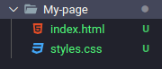

 
<br/>
<br/>

<h1 align="center">
  Criando uma página estática simples.
</h1>

Para iniciarmos precisamos criar dois arquivos dentro de uma pasta, um com o nome index.html e o styles.css 

 

Logo em seguida adicione o seguinte código no arquivo index.html.

```html
<!DOCTYPE html>
<html lang="PT">
<head>
  <meta charset="UTF-8">
  <meta name="viewport" content="width=device-width, initial-scale=1.0">
  <title>My-Page</title>
  <link rel="stylesheet" href="styles.css">
</head>
```
Aqui é onde fica uma parte importante onde colocamos o nome da página, o caminho do nosso arquivo CSS. Agora vamos criar nosso corpo da página o body e o header.

```html
<body>
  <header>
    <div class="links">
      <a href="#">Sobre</a>
      <a href="#">Aulas</a>
    </div>
  </header>
</body>
```
Como você pode observar criamos dois links dentro da tag header e da div que colocamos uma classe chamada links. Agora vamos colocar uma imagem que depois com o CSS iremos centralizar e deixar tudo lindão. Usaremos a tag img mas antes colocaremos ela dentro de uma div com uma id wrapper e logo após a imagem colocaremos um h1, h2, p onde no primeiro fica o título no segunda uma espécie de subtítulo e no terceiro um parágrafo, um simples texto.

```html
  <div id="wrapper">
    
    <h1>Lucas Torres</h1>
    <h2>Aluno frontend</h2>
    <p>Desenvolvedor junior frontend. Meus projetos estão <a href="github.com/torresfelicio">aqui.</a> </p>
  </div>
```
E por final no nosso arquivo html criaremos os links no final da página para linkar com as redes sociais. Usaremos mais uma div com uma id footer e um class links logo você irá entender o porque uma classe e uma id na mesma div. Um detalhe agora não esqueça de fechar as tags body e html.

```html
  <div id="footer" class="links">
    <a href="/" target="_blank">Github</a>
    <a href="/" target="_blank">Twitter</a>
    <a href="/" target="_blank">Linkedin</a>
  </div>
</body>
</html>
```
E o código completo vai ficar assim:

```html
<!DOCTYPE html>
<html lang="en">
<head>
  <meta charset="UTF-8">
  <meta name="viewport" content="width=device-width, initial-scale=1.0">
  <title>My-Page</title>
  <link rel="stylesheet" href="styles2.css">
</head>
<body>
  <header>
    <div class="links">
      <a href="/">Sobre</a>
      <a href="/">Aulas</a>
    </div>
  </header>

  <div id="wrapper">
    
    <h1>Lucas Torres</h1>
    <h2>Aluno frontend</h2>
    <p>Desenvolvedor junior frontend. Meus projetos estão <a href="github.com/torresfelicio">aqui.</a> </p>
  </div>

  <div id="footer" class="links">
    <a href="/" target="_blank">Github</a>
    <a href="/" target="_blank">Twitter</a>
    <a href="/" target="_blank">Linkedin</a>
  </div>
</body>
</html>
```

Haha se você abrir esse arquivo index.html no seu navegador ele vai estar estranhão né, mas agora vamos deixá lo com uma aparência melhor, vá até o seu arquivo CSS e digite o seguinte código e veja a magia acontecer.

```css
@import url('https://fonts.googleapis.com/css2?family=Roboto:wght@400;700&display=swap');

:root {
  --color-primary: gold;
}

* {
  margin: 0;
  padding: 0;
  border: 0;
}
body {
  background: #3c0bad;
  color:#fff;
  font-family: 'Roboto', sans-serif;
}

header {
  background: rgba(3, 4, 4, 0.1);
  padding: 22px;
}

.links {
  text-align: center;
  margin-bottom: 20px;
}

.links a {
  color: rgb(255, 255, 255);
  margin: 0 18px;
  font-size: 18px;
  line-height: 28px;
  text-decoration: none;
}

#footer a {
  border-bottom: 2px solid var(--color-primary);
}

.links a:hover {
  color: var(--color-primary);
  transition: 300ms;
}

#wrapper {
  text-align: center;
  padding: 32px;
}

#wrapper img {
  border: 5px solid var(--color-primary);
  margin-bottom: 22px;
  border-radius: 50%;
  height: 250px;
}

#wrapper h1 {
  font-size: 42px;
  line-height: 52px;
  font-weight: bold;
}

#wrapper h2 {
  font-size: 24px;
  line-height: 34px;
  font-weight: normal;
  margin-top: 8px;
  opacity: 0.8;
}

#wrapper p {
  max-width: 500px;
  margin: 10px auto;
  font-size: 24px;
  line-height: 34px;
}

#wrapper p a {
  color: var(--color-primary);
}
```

Bacana não é mesmo? em poucos minutos você foi capaz de criar uma página lindona. Agora faça experiências mude as cores as fontes, imagens deixe essa página com a sua cara!